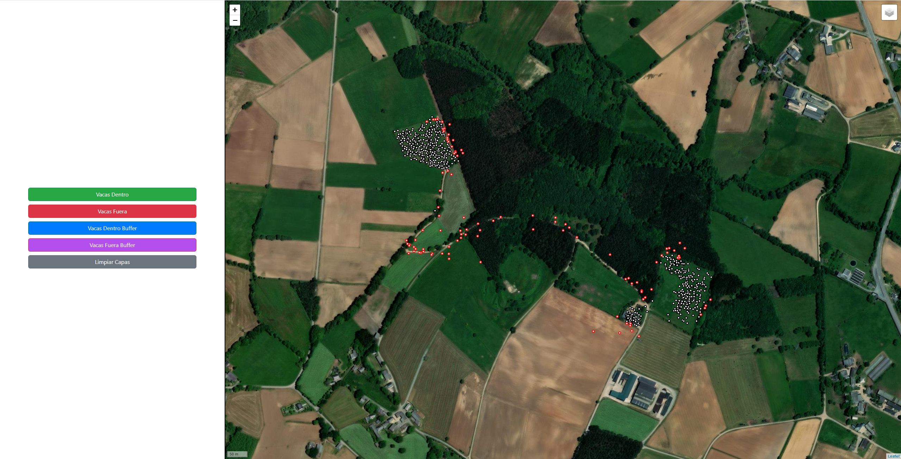
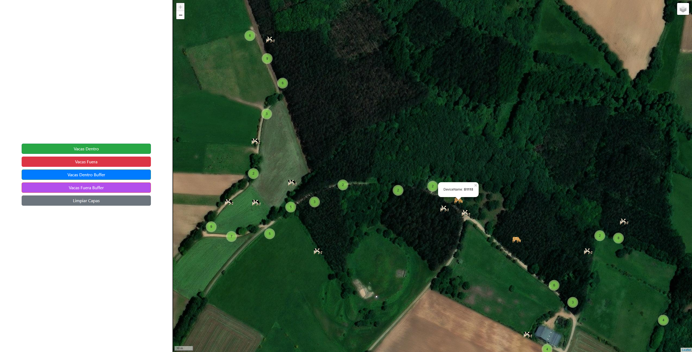

\tableofcontents
\newpage

# Filtrado y limpieza de datos

En esta sección se describirán los pasos seguidos en el archivo `preprocess.ipynb` para el filtrado y limpieza de los dos archivos con los que se trabajará en la práctica: *cows_pos.csv* y *fincas.json*.

## Archivo *cows_pos.csv*

En primer lugar, se cargó el archivo *cows_pos.csv* en un *DataFrame* de pandas. La columna *time* se convirtió a tipo *datetime* para facilitar su manipulación. 

A continuación, se crearon dos *timestamps* que definen el rango temporal de interés: desde el 20 de abril de 2023 hasta el 25 de abril de 2023. Se filtraron las filas del *DataFrame* para conservar únicamente aquellas cuyo valor en la columna *time* se encontraba dentro de este rango.

Posteriormente, se eliminaron 3 filas que tenían valores nulos en la columna *location*. Cabe destacar que la única columna espacial contenía datos de la forma *lat::long*, así que se definió una función para procesar estos valores, la cual realizaba las siguientes tareas:

- Comprobar que todas las filas tuvieran el formato correcto (dos números separados por "::").
- Separar los valores de latitud (*lat*) y longitud (*lon*).
- Comprobar que en el valor original la latitud era el primer elemento. Había casos en los que la longitud (que sabemos que es negativa en Galicia) aparecía en primer lugar en la columna original, por lo que verificamos que el valor *lat* obtenido en el paso anterior fuera positivo, intercambiándo los valores de *lat* y *lon* en caso contrario.
- Corregir ciertas longitudes que comenzaban por -6 (vacas situadas en Asturias), cambiándolas para que comenzaran por -7.

Se aplicó esta función a la columna *location* y se crearon dos nuevas columnas en el *DataFrame*: *latitud* y *longitud*. A partir de ellas, convertimos el *DataFrame* en un *GeoDataFrame* de geopandas, utilizando el sistema de referencia EPSG:4326 y creando una columna de puntos de *geometry*, manejables por PostGIS.

## Archivo *fincas.json*

En cuanto al segundo archivo, *fincas.json*, se cargó en un *GeoDataFrame* de geopandas directamente, ya que el archivo estaba en formato GeoJSON. Se comprobó que el sistema de referencia era EPSG:4326 y se dividió su contenido en *Polygons* (uno por finca), ya que el archivo original contenía un *MultiPolygon*. A continuación, empleamos la latitud del centroide de cada finca para eliminar aquellas 3 más al sur, quedándonos con 15 fincas de las 18 originales. En este paso se aplicó una transformación al sistema de referencia EPSG:32629, para evitar posibles problemas.

# Carga de datos en la BD

Para la carga de datos de las dos tablas en la base de datos PostGIS, existían varias opciones como usar QGIS, crear el esquema de la base de datos y cargar los datos directamente en DBeaver, o cargarlos mediante comandos en la terminal. Se optó por cargar los datos mediante código en *Python*.

Para realizar dicha carga, se utilizó la librería *SQLAlchemy* para gestionar la conexión con la base de datos. En primer lugar, se creó un motor de conexión utilizando la función *create_engine*, proporcionando la URL de conexión a la base de datos. A continuación, se empleó el método *to_postgis* de geopandas para cargar los *GeoDataFrames* previamente creados en la base de datos. Este método permite especificar el nombre de la tabla destino, el motor de conexión y la opción de reemplazar la tabla existente. A continuación, se realizó una comprobación empleando la función *read_postgis* de geopandas para asegurarse de que el número de filas y columnas en las tablas de la base de datos coincidía con el número de filas y columnas en los *GeoDataFrames* originales.

Este proceso se llevó a cabo también en el archivo *preprocess.ipynb*, justo después de la limpieza y filtrado de los datos.

# Implementación

En esta sección se describirán los pasos posteriores a la carga en la base de datos, incluyendo la creación de vistas necesarias, su posterior publicación en GeoServer y en servidor propio a través de una API y la implementación de un visor web.

## Consultas de separación de vacas

Una vez se han cargado los datos en PostGIS, el siguiente paso es crear las consultas necesarias para diferenciar las vacas que están dentro y fuera de las fincas. Para ello, se crean dos vistas que pueden ser consultadas posteriormente desde GeoServer y el servidor propio. Se pueden observar en el archivo `consultas.sql`.

Como se aprecia en las consultas, se utiliza la función espacial *ST_Within* y el *INNER JOIN* para determinar si una vaca está dentro de una finca. En la segunda consulta, se utiliza una subconsulta con *NOT EXISTS* para seleccionar las vacas que no están dentro de ninguna finca.

## Configuración y publicación en GeoServer

Para publicar las vistas creadas en PostGIS en GeoServer, se siguieron los siguientes pasos:

1. **Acceso a GeoServer**: A través de la terminal, se activó el ejecutable *startup.sh de GeoServer* (en el caso de MacOS) o se ejecutó el comando `net start geoserver` (en el caso de Windows) y se accedió a la interfaz web mediante un navegador, utilizando la URL `http://localhost:8080/geoserver`. Una vez dentro, se inició sesión con las credenciales por defecto (usuario: *admin*, contraseña: *geoserver*).

2. **Creación de capas**: Dado que en la última práctica se había creado un espacio de trabajo y un almacén de datos (ambos llamados RXDET), se procedió a añadir las vistas como nuevas capas dentro del almacén de datos existente. Para ello, se seleccionó el almacén de datos RXDET y se hizo clic en "Agregar nueva capa". Se eligieron las vistas *vacas_dentro* y *vacas_fuera* una por una, configurando sus propiedades y estilos según fuera necesario.

3. **Definición de estilos**: Como en el paso siguiente se iba a acceder a ellas a través de WMS, fue necesario definir estilos adecuados para cada capa. Para la capa *vacas_dentro*, se empleó el estilo existente *capitals*, que mostraba los puntos en blanco con borde negro. Para la capa *vacas_fuera*, se creó un nuevo estilo a partir del anterior, modificando el borde de los puntos a color rojo. Ambos estilos se definieron utilizando SLD (Styled Layer Descriptor).

## Visualización de las capas de GeoServer

A continuación, para mostrar las capas se crearon 3 archivos para el *frontend*:

1. **Archivo .html**: En él se cargan todos los elementos que se van a emplear en el *.js*, así como una referencia al archivo de estilo *.css* y al script de Leaflet *.js*. También se añade el título de la página y cómo se va a dividir el espacio de forma columnar entre el panel de botones y el mapa.

2. **Archivo .css**: Contiene los estilos para el diseño de la página, incluyendo la disposición del mapa y el panel de botones, así como estilos específicos para los elementos interactivos como los botones.

3. **Archivo .js**: En este archivo se implementa la lógica para cargar y mostrar las capas de GeoServer en el mapa utilizando la biblioteca Leaflet. Se comienza añadiendo el mapa base (empleando una vista satelital) y definiendo la vista inicial centrada en la zona de estudio y a un nivel de zoom adecuado. A continuación, se definen las capas WMS para las vacas dentro y fuera de las fincas, especificando la URL del servicio WMS de GeoServer, el nombre de la capa y otros parámetros necesarios. Por último, se gestionan los eventos de los botones para activar o desactivar la visualización de las capas correspondientes: *vacas_dentro*, *vacas_fuera* (se pueden visualizar ambos a la vez) y *limpiar_capas*.

## Creación del servidor propio

Para la creación del servidor propio, se utilizaron dos archivos principales: `main.py` y `geometrias.py`.

- **Archivo `main.py`**: Este archivo contiene la configuración principal del servidor utilizando *FastAPI*. Se definen las rutas base de *localhost* y se incluye el enrutador de geometrias para gestionar las solicitudes relacionadas con las geometrías de las vacas. No ha sido necesario realizar ningún cambio respecto al publicado en el campus virtual.

- **Archivo `geometrias.py`**: En este archivo primeramente se configura la ruta base y se realiza la conexión a la base de datos PostGres utilizando *SQLAlchemy*. Por último, se definen las rutas para obtener las vacas dentro y fuera de las fincas, ejecutando las consultas SQL correspondientes y devolviendo los resultados en formato GeoJSON.

## Visualización de las capas del servidor propio

Para mostrar las capas del servidor propio, se creó un nuevo script, para poder reutilizar el mismo mapa.html y estilo.css, simplemente cambiando en el .html la referencia al script correspondiente. Los aspectos que cambian respecto al archivo .js anterior son los siguientes:

- **Carga de capas**: En lugar de utilizar capas WMS de GeoServer, se emplean capas GeoJSON que se obtienen mediante solicitudes *fetch* a las rutas definidas en el servidor propio. Esta acción se realiza en una función asíncrona *load_geom*, a la que hay que pasar como parámetro la URL de la ruta correspondiente (ya sea para las vacas dentro o fuera de las fincas). Una vez obtenidos los datos, se crean las capas correspondientes utilizando *L.geoJSON* de Leaflet y se gestionan los eventos de los botones para activar o desactivar la visualización de estas capas en el mapa.

- **Diferenciación de tipo de vacas**: Para diferenciar visualmente las vacas cuyo *deviceName* empieza por A de las que empiezan por B, en primer lugar se crean unos iconos personalizados con *L.icon*, definiendo la ruta de la imagen representativa de cada tipo y el tamaño. A continuación, se crean dos marcadores y una función *styleCow* que asigna el icono correspondiente según cómo comienza el *deviceName* de cada vaca. Esta función se pasa como parámetro a la función *L.geoJSON* al crear las capas, para que cada vaca se muestre con el icono adecuado.
Por último, también se pasa como párametro la función *popupVaca*, que crea un *popup* con el *deviceName* de cada vaca al hacer clic sobre ella.
Es importante destacar que para poder realizar esta diferenciación, ha sido necesario modificar las consultas SQL en las rutas del servidor propio para que devuelvan también la columna *deviceName* y no solo la geometría.

- **Clustering**: Para mejorar la visualización de las vacas en el mapa y hacerla más eficiente, se implementa el *clustering* utilizando la librería *Leaflet.markercluster*. Se crean las capas de vacas dentro y fuera de las fincas como antes, pero en lugar de añadirlas directamente al mapa, se crean grupos de clústeres con *L.markerClusterGroup* y se añaden las capas de vacas a estos grupos. Estos grupos son los que se añadirán al mapa al activar los botones correspondientes. 

## Vacas con margen de error (buffers)

Para implementar las capas de vacas con margen de error (buffers) en la visualización empleando **Geoserver**, se siguieron los siguientes pasos:

1. **Creación de vistas con buffers**: Se crearon dos nuevas vistas (*vacas_dentro_buffer* y *vacas_fuera_buffer*) en PostGIS que incluyen un buffer de 15 metros alrededor de cada vaca, utilizando la función espacial *ST_DWithin*, y para poder calcular distancias en metros se transformaron las geometrías al sistema de referencia EPSG:25829, ya que el EPSG:4326 utiliza grados decimales. El archivo `consultas.sql`se modificó con las consultas correspondientes.

2. **Publicación en GeoServer**: Se añadieron las nuevas vistas como capas en GeoServer, siguiendo el mismo procedimiento que para las capas sin buffers. Se definieron los mismos estilos que para las capas originales.

3. **Visualización en el visor web**: Se modificó el archivo .js del visor web para incluir las nuevas capas de buffers, cargándolas de la misma forma que las capas originales. Se añadieron nuevos botones para activar o desactivar la visualización de las capas *vacas_dentro_buffer* y *vacas_fuera_buffer*, gestionando los eventos correspondientes para cargar y mostrar estas capas en el mapa. Estos eventos incluyeron una nueva lógica para evitar que se puedan activar capas normales y de buffer al mismo tiempo, mostrando una alerta en caso de que el usuario intente hacerlo.

En el caso de la visualización empleando el **servidor propio**, se siguieron pasos similares:

1. **Creación de rutas para buffers**: Se añadieron dos nuevas rutas en el archivo `geometrias.py` para obtener las vacas dentro y fuera de las fincas con buffers, ejecutando las consultas SQL correspondientes y devolviendo los resultados en formato GeoJSON.

2. **Modificación del visor web**: Se modificó el archivo .js para el visor web que incluye las nuevas capas de buffers, cargándolas de la misma forma que las capas originales. Se añadieron nuevos botones para activar o desactivar la visualización de las capas *vacas_dentro_buffer* y *vacas_fuera_buffer*, gestionando los eventos correspondientes para cargar y mostrar estas capas en el mapa. Al igual que en el caso de GeoServer, se implementó una lógica para evitar que se puedan activar capas normales y de buffer al mismo tiempo, mostrando una alerta en caso de que el usuario intente hacerlo.

El archivo común mapa.html también fue modificado para adaptarse a estas nuevas capas, añadiendo los botones necesarios para su activación y desactivación.

## Mapa de Fontán

El último requisito consistía en añadir como mapa base la Carta Geométrica de Galicia de Domingo Fontán. Para ello, se utilizaron los servicios WMS disponibles en la [web oficial de la Xunta de Galicia](https://www.xunta.gal/servizos/mapas-wms-wmts), que permiten acceder a este mapa. Para implementarlo en ambos visores web (tanto el de GeoServer como el del servidor propio), se editaron los archivos .js correspondientes, creando una nueva capa con la función *L.tileLayer.wms*, especificando la URL del servicio WMS y algunos parámetros necesarios. Esta capa no se añadió al mapa por defecto, sino que se dejó disponible para que el usuario pueda activarla o desactivarla según sus preferencias.

Debido a algunos problemas de visualización que surgieron, fue necesario emplear funciones *bringToFront()* en las capas de vacas en el visor de GeoServer para asegurarse de que siempre se mostraran por encima del mapa base de Fontán. 

# Capturas de los visores web

